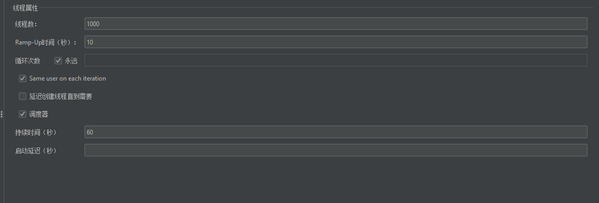
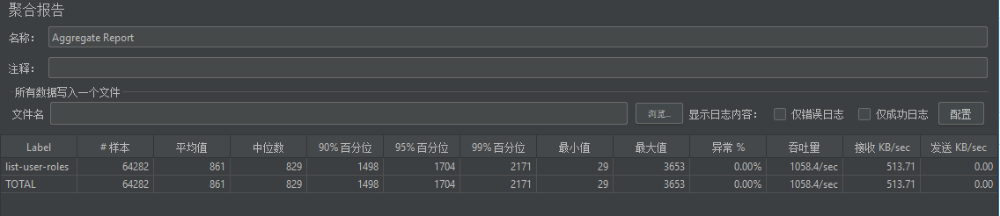
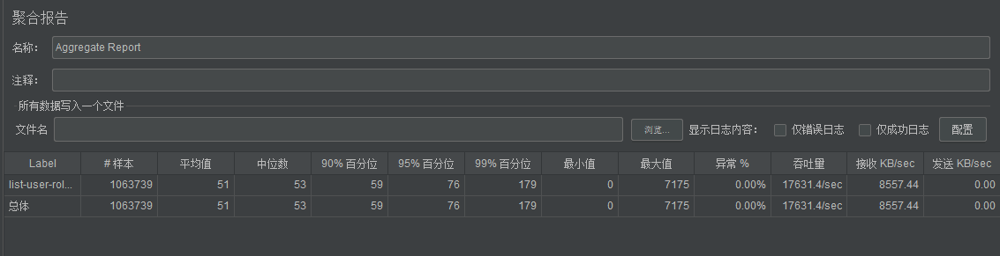
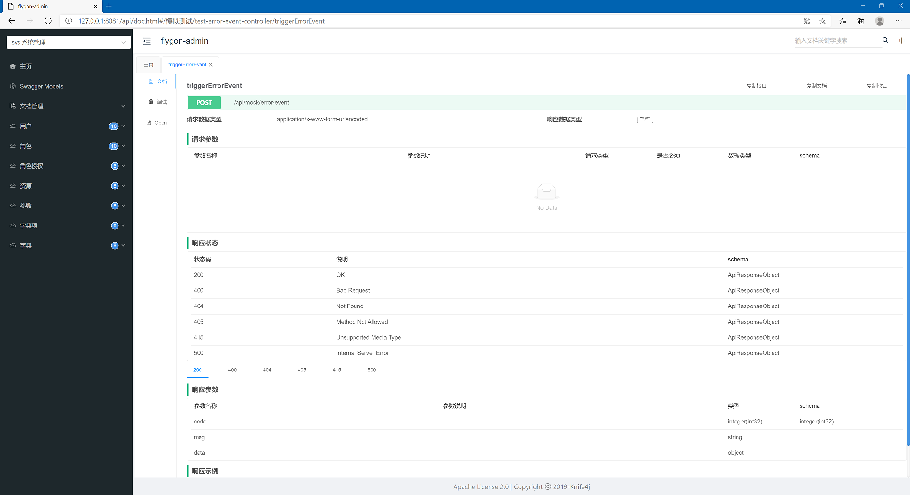
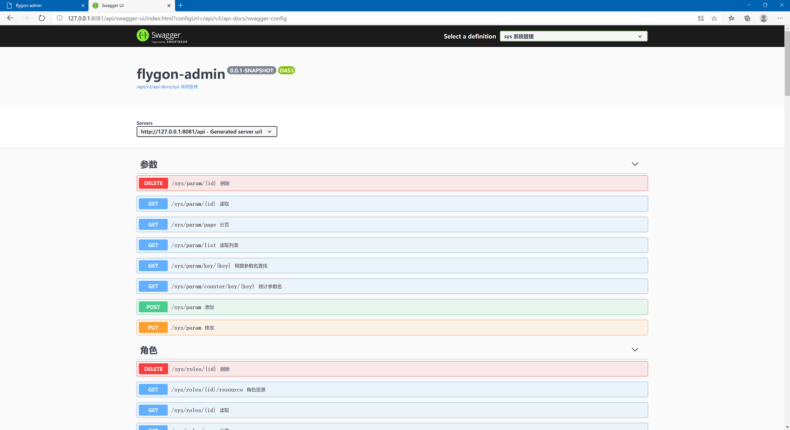
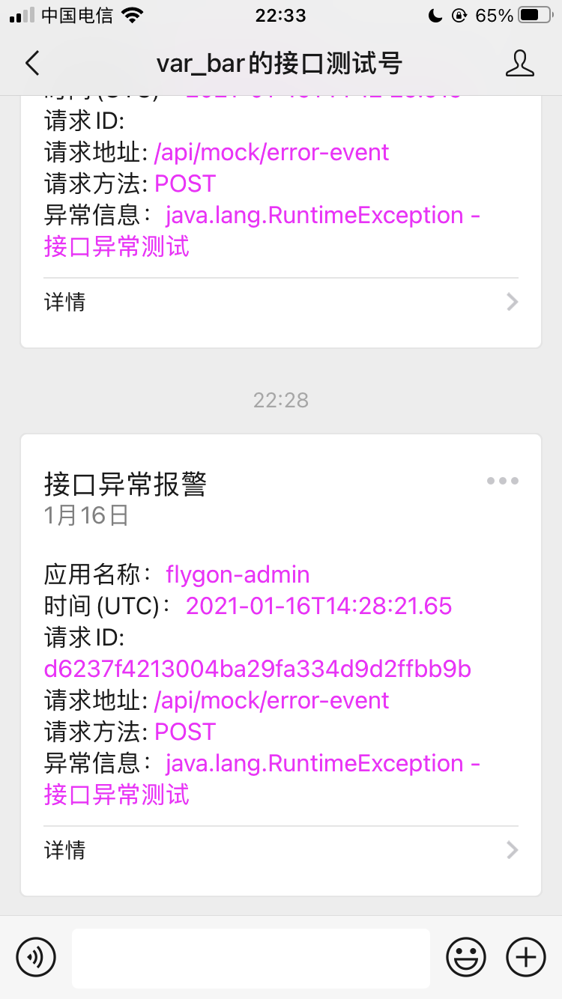
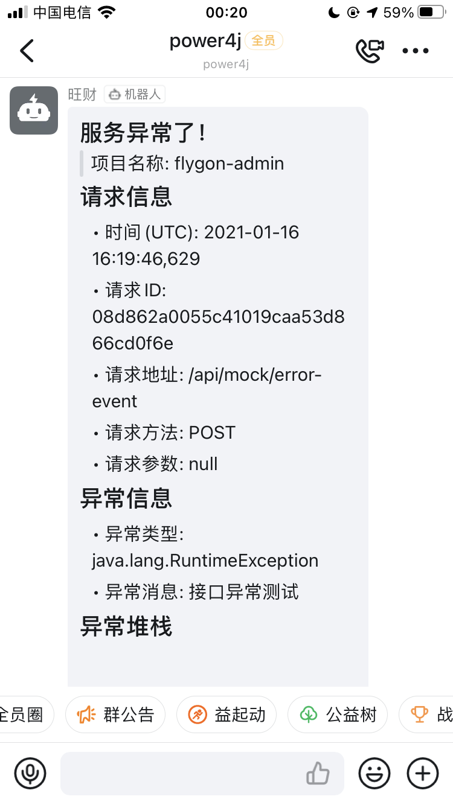

# 极(Ji) - 基于Spring Boot 2 的前后端分离权限管理系统


[](https://app.codacy.com/gh/power4j/ji-boot?utm_source=github.com&utm_medium=referral&utm_content=power4j/ji-boot&utm_campaign=Badge_Grade)
[](https://sonarcloud.io/dashboard?id=power4j_ji-boot)

- 使用 Spring Boot 最新版本
- 基于Spring Security 的 RBAC权限控制，访问控制可配置，也可以注解
- 菜单、按钮权限动态控制，且有越权控制
- 可选择使用`Redis`、`Caffeine`作为缓存，可以满足集群、单机部署需求。
- 基于OpenAPI V3的API文档管理，支持`swagger`和`knife4j`
- 公共模块组件化，方便独立维护，代码复用性高
- 前后端采用开源框架`D2-Admin`，使用`d2-crud-plus`极大提高了UI开发效率

本项目实现了一个权限管理系统的最基础部分，适合开发中小型项目，由于功能简洁，可以很容易地进行定制，
变成你自己的`starter`脚手架。


> 体验地址 http://ji-boot-demo.etcd.ltd/
> 
>用户名/密码: `admin/admin`
>
> 如需本地部署体验，请使用`ji-boot-docker`项目


注意事项：本项目使用`spring-javaformat`插件来统一代码风格，项目打包报错请执行`mvn spring-javaformat:apply`一键修复。

## 功能

- [x] API文档：可同时使用`swagger`和`knife4j`
- [x] 资源管理：负责管理UI资源，如菜单、按钮
- [x] 权限管理：用户、角色、资源授权、角色授权
- [x] 公共参数、数据字典
- [x] 常量字典: 消除硬编码,前后端统一维护字典数据
- [x] 服务异常报: 微信、钉钉
- [x] 任务调度
- [ ] 登录日志、接口审计日志
- [ ] 数据权限
- [x] 报表功能
- [ ] 公众号、小程序登录认证
- [ ] 支付宝、微信支付


## 用到的开源框架、组件

- [Mybatis-Plus](https://github.com/baomidou/mybatis-plus)
- [Dinger(叮鸽)](https://github.com/AnswerAIL/dingtalk-spring-boot-starter)
- [WxJava](https://github.com/Wechat-Group/WxJava)
- [Knife4j](https://gitee.com/xiaoym/knife4j)
- [D2-Admin](https://github.com/d2-projects/d2-admin)
- [d2-crud-plus](https://github.com/greper/d2-crud-plus)


## 配置项

```yaml
ji-boot:
  doc:
    global-security-scheme: 
      # 开启后能在swagger页面设置api-token,这样才能以用户的身份调用后端接口
      enabled: false
  # 缓存配置
  cache:
    # redisson caffeine none
    type: redisson
    caffeine:
      spec: "expireAfterWrite=24h,maximumSize=100000"
    redisson:
      ttl: 86400000
      max-idle-time: 36000
      max-size: 0
  notify:
    # 钉钉消息通知
    ding-talk:
      enabled: true
    # 公众号消息通知
    wx-mp:
      enabled: true
      app-id: ${WX_MP_APPID:wxc6222bd36479c057}
      secret: ${WX_MP_SECRET}
      # 消息订阅者
      subscribers: oiwtWuMNNa6njL3bE7_9ADOKMEWc
  # 常量字典
  dict:
    # 需要扫描项目以外的包
    scan-packages: com.power4j.ji
    # 启用内建的API接口
    enable-endpoint: true
    # 接口URL
    endpoint-base-url: /sys/immutable-dictionaries
  # 自定义验证码产生地址和消费地址
  captcha:
    code-url: '/code'
    consumer: '/login'
  security:
    # 可自定义登录、注销地址
    login-url: '/login'
    logout-url: '/logout'
    api-token:
      # 过期时间,秒
      expire-sec: 86400
      # 每个用户的并发登录控制
      max-user-token: 2
    # 自定义安全访问控制
    access:
      enabled: true
      # 静态资源,放行
      ignore:
        patterns: "/static/**,/webjars/**,/favicon.ico"
      filters:
        # 只允许特定IP访问监控端点
        - patterns: '/actuator/**'
          methods: GET,POST
          access: 'hasIpAddress("127.0.0.1")'
        # swagger 放行
        - patterns: '/swagger-ui/**,/swagger-ui.html,/swagger-resources'
          methods: GET
          access: permitAll
        # knife4j 放行  
        - patterns: '/doc.html'
          methods: GET
          access: permitAll
        # OpenAPI端点 放行    
        - patterns: '/v3/api-docs/**'
          methods: GET
          access: permitAll
        # 验证码服务放行  
        - patterns: ${flygon.captcha.service-url}
          methods: GET
          access: permitAll
        # druid 监控放行  
        - patterns: '/druid/**'
          methods: GET,POST
          access: permitAll

```

## 性能

没有花太多时间专门做性能优化，但是对认证过程做了缓存优化，因为这个地方性能瓶颈较大，优化前后差距巨大。

### 测试结果

Jmeter 配置



> 1C2G 云服务器（corretto Jdk 11） `-Xms256m -Xmx512m`




> 12C16G 台式机（oracle Jdk 8） `-Xms1g -Xmx1g`




### 界面截图














## Special Thanks

- [JetBrains Developer Toolbox](https://www.jetbrains.com/?from=sequence)


 ## 联系方式
 


